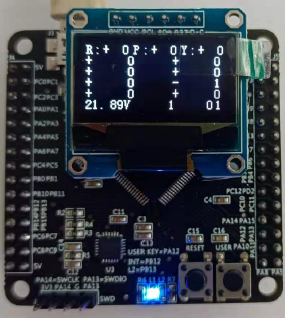

# Four-wheel_differential_drive
此專案是基於星洛智能的四驅差分驅動底盤所撰寫
※ 開機請靜待 3 秒，期間也不要接上 USB 或啟動控制程式。

## 車輪方向定義
如圖所示，以 OLED 顯示器朝向為正，右上為 A 輪，逆時針旋轉為 ABCD 輪。

## 指示燈說明
藍燈恆亮，表示控制板通電。
紅燈緩慢閃爍，表示正常運行。
紅燈快速閃爍，表示電量較低。
※ 請勿使電量低於 22.5 V

## 手把控制
使用時，先按中間 “START” 啟動手把。
△：啟動馬達
×：關閉馬達
左蘑菇頭：前後平移+左右自轉

## 充電說明
電池低於 22.5 V 會關閉馬達，避免燒毀電池，使用標配的充電器充電後會自行復原。
充電過程，一律關閉電源，否則若底盤損毀，後果自負。

## Project Installation
$ cd ~/common_ws/src

$ git clone https://github.com/Yuntechec404/four_wheel_differential_drive.git

$ cd ..

$ catkin_make

## How to run
$ source ~/.bashrc

$ roslaunch four_wheel_car_controller driver.launch
